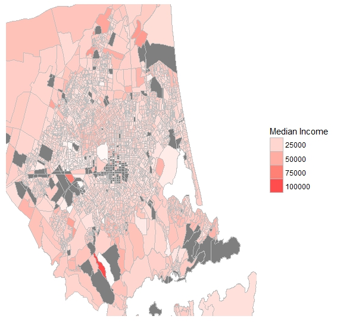

# NZ Maps

The following code can be used in order plot a simple choropleth map of NZ (or parts of NZ) from the MB2013_HD_Clipped.shp shape file provided from [Statistics NZ](http://archive.stats.govt.nz/browse_for_stats/Maps_and_geography/Geographic-areas/digital-boundary-files.aspx). This file can be found under the header census-based files, ESRI shapefiles and New Zealand 2013(NZTM). Due to the size of this data file it is not hosted here along with the code and must be downloaded seprately. 

I also make use of the NZ 2013 census data (also provided by Statistics NZ, but hosted here with the code) to explore how the median personal income differs over different suburbs in the cities Palmerston North and Christchurch. I choose Palmerston North and Christchurch simply because they are the two places I have called home over the last several years. The aim of this collection of code is to allow for easy plotting of simple choropleth maps of any region in NZ, with the hope of extending this collection to incorporate other mapping approaches (e.g ggmaps and leaflet) as I learn these. 

# Example using ggplot

Load the shape file, transform it into a tidy tibble and pull out the meshblock ids. The shape file uploaded here is for the entirety of NZ. Since we only wish to look at the map of Christchurch for this example we can also remove all rows from the data frame which do not relate to the territory area Christchurch.

```R
library(rgdal)
library(broom)

shp <- readOGR(dsn ="./2013 Digital Boundaries High Def Clipped" ,layer="MB2013_HD_Clipped") 
tidy_nzdf <- tidy(shp)

# Pulling out polygon id to match on when mergeing with meshblock id 
shp$polyID <- sapply(slot(shp, "polygons"), function(x) slot(x, "ID"))

# Merge to get meshblock ids (again can take a couple mins)
nz_df <- merge(tidy_nzdf, shp, by.x = "id", by.y="polyID")

## remove everything that is not Christchurch ##
Chch_df <- tidy_nzdf[which(tidy_nzdf$TA2013_NAM=="Christchurch City"),]
```
Note that many tutorials found online may still make use of the functions `readShapePoly` from the maptools package and `fortify` from the ggplot2 package. These functions should not be used, as mentioned in the help files, as they are no longer maintained and likely to be deprecated.

Having dealt to the shape file we can now load in and clean our census data so that it can be merged with the shapefile data.

```R
# Reading in the census data #
pop_data_Chch <- read.xlsx("./2013_mb_dataset_Canterbury_Region/2013-mb-dataset-Canterbury-Region-individual-part-2.xlsx", sheet=4, startRow=9) # format not the nicest

# cleaning # 
pop_Income_chch <- pop_data_Chch[,c(1,184)] # pulling out just meshblock and median personal income
colnames(pop_Income_chch) <- c("MB2013", "Median_Income")
pop_Income_chch <- pop_Income_chch[-1,]
pop_Income_chch$MB2013 <- gsub("[^0-9]", "", pop_Income_chch$MB2013) # removing MB from in front of id number 

# merging with the shape file #
Chch_full <- merge(Chch_df, pop_Income_chch, by.x='MB2013', by.y='MB2013', all.x=TRUE)
Chch_full$Median_Income <- as.numeric(Chch_full$Median_Income) # warning NA's introduced -- due to ..C and * in dataset that were used instead of NA 
```

Now the fun part... where we can produce a pretty map!

```R
# Zoomed in on Christchurch city (removing banks pepeninsula area) and coloured by median income #
ggplot(data=Chch_full, aes(x=long, y=lat, group=group)) + geom_polygon(aes(fill=Median_Income), colour='gray', 
                  size=0.1) + theme(line = element_blank(), axis.text=element_blank(),axis.title=element_blank(), 
                  panel.background = element_blank()) +
                  coord_cartesian(ylim=c(5190000,5170000), xlim=c(1560000, 1585000)) +
                  scale_fill_gradient2("#4d4dff", mid = "white", high = "#ff4d4d") + guides(fill=guide_legend(title="Median Income"))
```


